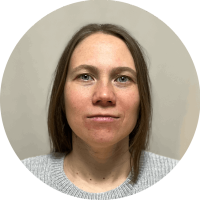

# Alexandra Paramonova
### Front-end developer (Junior)
*Yekaterinburg, Russia* </br>
*01/26/1987*

## Contacts

* **Phone**: +7-912-605-3781
* **E-mail**: alpar.wb@gmail.com
* **Telegram**: @alexpar_wd

---

## About

My goal is to create beautiful and interactive websites. Previously I worked as a software tester. For family reasons, I have not worked for several years. Now I want to be a good front-end developer.

## Skills

* Git
* HTML
* CSS
* Javascript

## Code Example
*Convert color in the LAB color space to its polar coordinaties, the LCH format.*
```javascript
export function convertLabToLch(colorLab) {
    // convert radians to degrees
    const toDegrees = radians => radians * (180/Math.PI);

    const [L, a, b] = colorLab; // perceived Lightness, a - how green/red the color is, b - how blue/yellow the color is

    // convert to Lch
    const C = Math.sqrt(a ** 2 + b ** 2) // Chroma
    let H = toDegrees(Math.atan2(b, a));
    H = H >= 0 ? H : H + 360; // Hue, in degrees [0 to 360)

    const colorLch = [L, C, H]; // perceived Lightness, Chroma, Hue

    return colorLch;
}
```

## Work Experience
**May 2011 - January 2019** </br>
Software tester </br>
**Aurit**, Yekaterinburg

## Education
**2004 - 2010** </br>
Applied Mathematics and Physics (master's degree) </br>
The Physical Engineering faculty </br>
*Ural Federal University, Yekaterinburg*

## English
**B2**
